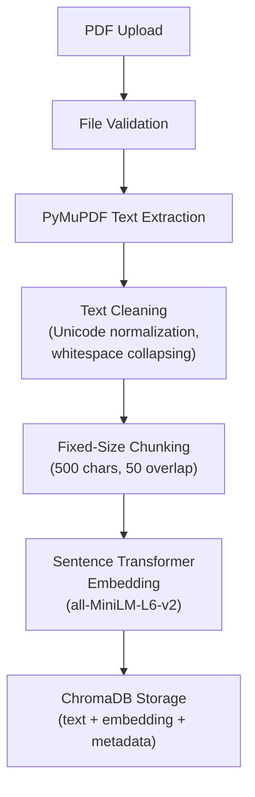
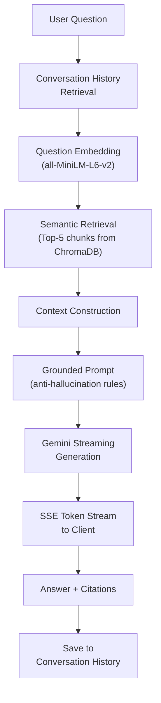
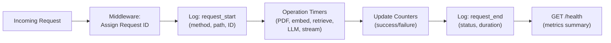

# AI Document Intelligence System

A **RAG-based (Retrieval-Augmented Generation) document question-answering system** that allows users to upload PDF documents, ask questions about their content, and receive grounded, citation-backed answers streamed in real time.

Built with FastAPI, Google Gemini, Sentence Transformers, and ChromaDB.

---

## Table of Contents

- [Features](#features)
- [Architecture](#architecture)
- [Technology Stack](#technology-stack)
- [Setup & Installation](#setup--installation)
- [Configuration](#configuration)
- [Running the Application](#running-the-application)
- [API Documentation](#api-documentation)
- [Streaming](#streaming)
- [Conversation History](#conversation-history)
- [Observability](#observability)
- [Engineering Decisions](#engineering-decisions)
- [Evaluation](#evaluation)
- [Known Limitations](#known-limitations)

---

## Features

### Core RAG Pipeline
- **PDF Upload & Processing** — Upload PDF documents for automatic text extraction, cleaning, chunking, and indexing
- **Semantic Search** — Sentence Transformer embeddings with ChromaDB vector store for semantic similarity retrieval
- **Grounded Q&A** — Gemini-powered answers strictly based on document context with source citations
- **Anti-Hallucination** — Explicit prompting to prevent fabricated answers; returns `insufficient information` when context is lacking

### Bonus Capabilities
- **Streaming** — Server-Sent Events (SSE) for progressive answer delivery as Gemini generates tokens
- **Conversation History** — Follow-up question support with persistent conversation sessions
- **Observability** — Request IDs, operation timing, structured logging, and in-memory metrics

---

## Architecture

### Document Ingestion Pipeline



### Question Answering Pipeline



### Observability Flow



---

## Technology Stack

| Component | Technology | Purpose |
|-----------|-----------|---------|
| Backend | FastAPI | REST API with async support and streaming |
| LLM | Google Gemini (gemini-2.0-flash) | Answer generation with streaming |
| Embeddings | Sentence Transformers (all-MiniLM-L6-v2) | Text to vector embeddings |
| Vector Store | ChromaDB | Persistent semantic similarity search |
| PDF Processing | PyMuPDF (pymupdf) | Text extraction from PDFs |
| Streaming | SSE via StreamingResponse | Progressive answer delivery |
| Configuration | pydantic-settings | Environment-based config |

---

## Setup & Installation

### Prerequisites

- Python 3.10 or higher
- A Google Gemini API key ([Get one here](https://aistudio.google.com/apikey))

### 1. Clone the Repository

```bash
cd digixito-RAG
```

### 2. Create a Virtual Environment

```bash
python -m venv venv

# Windows
venv\Scripts\activate

# macOS/Linux
source venv/bin/activate
```

### 3. Install Dependencies

```bash
pip install -r requirements.txt
```

### 4. Configure Environment

```bash
# Copy the example environment file
copy .env.example .env    # Windows
# cp .env.example .env    # macOS/Linux

# Edit .env and set your Gemini API key
# GEMINI_API_KEY=your_actual_api_key_here
```

### 5. Start the Application

```bash
uvicorn app.main:app --reload --host 0.0.0.0 --port 8000
```

The API will be available at `http://localhost:8000`.

Interactive API docs: `http://localhost:8000/docs`

---

## Configuration

All configuration is managed through environment variables (or a `.env` file).

| Variable | Required | Default | Description |
|----------|----------|---------|-------------|
| `GEMINI_API_KEY` | **Yes** | — | Google Gemini API key |
| `GEMINI_MODEL` | No | `gemini-2.0-flash` | Gemini model name |
| `EMBEDDING_MODEL` | No | `all-MiniLM-L6-v2` | Sentence Transformers model |
| `CHROMA_PERSIST_DIR` | No | `data/chromadb` | ChromaDB storage directory |
| `CHROMA_COLLECTION_NAME` | No | `documents` | ChromaDB collection name |
| `CHUNK_SIZE` | No | `500` | Characters per text chunk |
| `CHUNK_OVERLAP` | No | `50` | Character overlap between chunks |
| `TOP_K` | No | `5` | Number of chunks retrieved per query |
| `CONVERSATION_DIR` | No | `data/conversations` | Conversation history directory |
| `MAX_CONVERSATION_HISTORY` | No | `10` | Max messages in prompt context |
| `LOG_LEVEL` | No | `INFO` | Logging level |
| `UPLOAD_DIR` | No | `data/uploads` | Uploaded PDF storage |

---

## Running the Application

### Start the Server

```bash
uvicorn app.main:app --reload --host 0.0.0.0 --port 8000
```

### Upload a PDF Document

```bash
curl -X POST http://localhost:8000/upload \
  -F "file=@path/to/your/document.pdf"
```

### Ask a Question

```bash
curl -N -X POST http://localhost:8000/ask \
  -H "Content-Type: application/json" \
  -d '{"question": "What is the main topic of the document?"}'
```

### Ask a Follow-up Question

```bash
# Use the conversation_id from the previous response
curl -N -X POST http://localhost:8000/ask \
  -H "Content-Type: application/json" \
  -d '{"question": "Can you elaborate on that?", "conversation_id": "abc123..."}'
```

### Check Health

```bash
curl http://localhost:8000/health
```

---

## API Documentation

### POST /upload

Upload and process a PDF document.

**Request:**
```
POST /upload
Content-Type: multipart/form-data

file: <PDF file>
```

**Success Response (200):**
```json
{
  "message": "PDF uploaded and processed successfully.",
  "file_name": "annual_report.pdf",
  "num_pages": 42,
  "num_chunks": 187
}
```

**Error Responses:**
| Status | Detail |
|--------|--------|
| 400 | `No file name provided.` |
| 400 | `Invalid file type. Expected PDF, got 'file.txt'.` |
| 400 | `Uploaded file is empty.` |
| 422 | `No extractable text found in 'file.pdf'.` |
| 500 | `Failed to process PDF.` / `Failed to generate embeddings.` / `Failed to store document chunks.` |

---

### POST /ask

Ask a question about uploaded documents. Returns a **Server-Sent Events (SSE) stream**.

**Request:**
```json
{
  "question": "What was the company's revenue?",
  "conversation_id": null
}
```

- `question` (required): The question to ask.
- `conversation_id` (optional): ID of an existing conversation for follow-up questions. If `null`, a new conversation is created.

**Response:** SSE stream with the following event types:

```
event: token
data: {"text": "The company's"}

event: token
data: {"text": " revenue was"}

event: token
data: {"text": " $12.5 million."}

event: done
data: {"answer": "The company's revenue was $12.5 million. [annual_report.pdf, page 15]", "citations": [{"file_name": "annual_report.pdf", "page_number": 15}], "conversation_id": "a1b2c3d4..."}
```

**Error Event:**
```
event: error
data: {"error": "Streaming generation failed: ..."}
```

**Response Headers:**
| Header | Description |
|--------|-------------|
| `X-Request-ID` | Unique request identifier for tracing |
| `X-Conversation-ID` | Conversation ID for follow-up questions |
| `Content-Type` | `text/event-stream` |

**Error Responses:**
| Status | Detail |
|--------|--------|
| 400 | `Question cannot be empty.` |
| 500 | `Failed to retrieve relevant documents.` |

---

### GET /health

Return application health status and metrics.

**Response (200):**
```json
{
  "status": "healthy",
  "timestamp": "2025-01-15T10:30:00+0000",
  "embedding_model": "all-MiniLM-L6-v2",
  "gemini_model": "gemini-2.0-flash",
  "chromadb": {
    "status": "healthy",
    "collection": "documents",
    "document_count": 187
  },
  "metrics": {
    "requests": {"total": 50, "successful": 48, "failed": 2},
    "uploads": {"total": 3, "successful": 3, "failed": 0},
    "queries": {"total": 15, "successful": 14, "failed": 1},
    "latencies": {
      "http_request": {"count": 50, "avg_ms": 234.5, "max_ms": 1200.0, "min_ms": 5.2},
      "retrieval_pipeline": {"count": 15, "avg_ms": 45.3, "max_ms": 120.0, "min_ms": 12.1}
    }
  }
}
```

---

## Streaming

### Why SSE?

Server-Sent Events (SSE) was chosen over raw `StreamingResponse` for these reasons:

1. **Structured Format** — SSE provides named events (`token`, `done`, `error`) with JSON data payloads, making it easy for clients to parse and react to different event types.
2. **Browser Native** — SSE is natively supported via the `EventSource` API in browsers, enabling direct consumption from web frontends.
3. **Reconnection** — SSE has built-in reconnection semantics, which is useful for unreliable connections.
4. **Simplicity** — No WebSocket upgrade handshake needed; works over standard HTTP.

### How Streaming Works

1. Client sends a `POST /ask` request with a question.
2. Server retrieves context, builds the grounded prompt, and starts Gemini streaming.
3. As Gemini generates text, each chunk is sent as an SSE `token` event.
4. The server accumulates all chunks into the full answer.
5. After generation completes, a `done` event is sent with the complete answer, citations, and conversation ID.
6. The full answer is saved to conversation history.

### Client-Side Reconstruction

To reconstruct the full answer on the client:

```javascript
const eventSource = new EventSource('/ask', { method: 'POST', ... });
// or using fetch with ReadableStream:

const response = await fetch('/ask', {
  method: 'POST',
  headers: { 'Content-Type': 'application/json' },
  body: JSON.stringify({ question: 'What is the revenue?' })
});

const reader = response.body.getReader();
const decoder = new TextDecoder();
let fullAnswer = '';

while (true) {
  const { done, value } = await reader.read();
  if (done) break;

  const text = decoder.decode(value);
  // Parse SSE events from text
  // Concatenate token data to build the full answer
}
```

### Edge Cases

- **`insufficient information`** — If Gemini determines the answer isn't supported, it streams this response normally. The system does not fabricate content.
- **Stream interruption** — If the connection drops, the `done` event won't be received. The partial answer is still saved to conversation history.
- **Errors** — API failures during streaming emit an `error` event so the client can display an appropriate message.

---

## Conversation History

### How It Works

1. Each conversation is identified by a UUID (`conversation_id`).
2. When no `conversation_id` is provided in `/ask`, a new one is automatically created and returned.
3. User questions and assistant answers (with citations) are persisted to JSON files on disk.
4. When a follow-up question arrives, recent conversation history is included in the prompt to help Gemini understand context (e.g., pronoun resolution).

### Storage

Conversations are stored as JSON files at `data/conversations/{conversation_id}.json`:

```json
{
  "conversation_id": "a1b2c3d4...",
  "created_at": "2025-01-15T10:00:00+00:00",
  "messages": [
    {
      "role": "user",
      "content": "What was the revenue in 2024?",
      "timestamp": "2025-01-15T10:00:01+00:00"
    },
    {
      "role": "assistant",
      "content": "The revenue in 2024 was $12.5 million. [annual_report.pdf, page 15]",
      "timestamp": "2025-01-15T10:00:05+00:00",
      "citations": [{"file_name": "annual_report.pdf", "page_number": 15}]
    }
  ]
}
```

### Important: Grounding Rule

Conversation history is used **only** to help the LLM understand the user's intent (e.g., resolving "What about last year?" to "What was the revenue last year?"). It is **never** used as factual evidence. The LLM must still find supporting information in the retrieved document chunks. If no supporting context exists, it returns `insufficient information`.

---

## Observability

### What Is Tracked

| Metric | Description |
|--------|-------------|
| **Request ID** | Unique UUID assigned to every HTTP request, included in logs and response headers |
| **Request Logging** | Method, path, status code, and duration for every request |
| **Operation Timing** | Latency (ms) for: PDF processing, embedding generation, ChromaDB queries, LLM generation, streaming |
| **Request Counters** | Total, successful, and failed counts for: all requests, uploads, queries |
| **Error Tracking** | Detailed error information logged with request context |

### Implementation

The observability system uses three components:

1. **Structured Logs** — JSON-formatted log lines with `timestamp`, `level`, `logger`, `request_id`, and `message`. Every log line includes the request ID for cross-referencing.

2. **FastAPI Middleware** — Automatically assigns request IDs, logs request start/end with timing, and increments counters for every HTTP request.

3. **In-Memory Metrics** — Lightweight counters and latency records (last 100 per operation) exposed via `GET /health`. No external infrastructure required.

### Why This Approach

- **No external dependencies** — No Prometheus, Grafana, ELK, or cloud monitoring services required.
- **Zero configuration** — Works out of the box with the application.
- **Sufficient for the assignment** — Provides enough visibility to understand request flow, diagnose failures, and measure performance.
- **Production-upgradeable** — The structured logging format can be fed into any log aggregation system, and the metrics pattern can be replaced with Prometheus counters if needed.

---

## Engineering Decisions

### Embedding Model: `all-MiniLM-L6-v2`

**Why selected:**
- Lightweight (~22 MB) and fast — runs comfortably on CPU
- 384-dimensional embeddings — good balance between quality and storage/compute cost
- Well-established model with strong performance on semantic similarity benchmarks
- Widely used in RAG applications, making it easy to understand and explain

**Trade-offs:**
- Max input of 512 tokens — longer chunks may be truncated
- Not state-of-the-art compared to newer, larger models (e.g., `bge-large`, `e5-large`)
- English-focused, may underperform on multilingual documents

### Chunk Size: 500 Characters

**Why selected:**
- Fits well within the 512-token limit of `all-MiniLM-L6-v2` (500 characters ≈ 100-125 tokens)
- Provides enough context for semantically meaningful chunks
- Small enough for precise retrieval — each chunk typically covers 1-2 paragraphs

**Trade-offs:**
- Very short sentences at chunk boundaries may lose context (mitigated by overlap)
- Long tables or lists may be split across chunks
- Character-based splitting doesn't respect sentence boundaries

### Chunk Overlap: 50 Characters

**Why selected:**
- Preserves context at chunk boundaries — approximately one sentence of overlap
- Prevents information loss when a concept spans a chunk boundary
- 10% overlap ratio (50/500) keeps duplication manageable

**Trade-offs:**
- Increases total number of chunks by ~10%, adding storage and compute cost
- May cause slightly redundant retrieval results (same info in adjacent chunks)

### Top-K: 5

**Why selected:**
- Provides sufficient context for comprehensive answers
- 5 chunks × ~500 characters = ~2,500 characters of context — well within Gemini's context window
- Balances recall (enough relevant information) with precision (less noise)

**Trade-offs:**
- Smaller K (e.g., 3) would be faster but may miss relevant information across pages
- Larger K (e.g., 10) would provide more context but increases noise and LLM cost
- Fixed K doesn't adapt to query complexity (simple questions may only need 1-2 chunks)

### ChromaDB

**Why selected:**
- Purpose-built vector database for semantic search
- Persistent storage with simple Python API
- No server process needed — runs in-process
- Built-in cosine similarity support

### Gemini (`gemini-2.0-flash`)

**Why selected:**
- Fast generation speed — good for streaming
- Capable instruction following — important for grounding rules
- Native streaming support via `generate_content_stream`
- Cost-effective for the assignment scope

### Streaming: Server-Sent Events

**Why selected:**
- Structured event format with named events (`token`, `done`, `error`)
- Browser-native via `EventSource` API
- Simpler than WebSockets for one-directional streaming
- No additional dependencies needed

### Conversation History: JSON Files

**Why selected:**
- No additional database dependency
- Simple to implement and understand
- Sufficient for the assignment scope (single-user, moderate volume)
- Easy to inspect and debug (human-readable files)

**Trade-offs:**
- Not suitable for high-concurrency production use
- No indexing or search capability
- File I/O may be slower than an in-memory store for high volumes

---

## Evaluation

### Evaluation Dataset

The file `evaluation/evaluation.csv` contains 12+ questions covering:

| Category | Description | Expected Behavior |
|----------|-------------|-------------------|
| Direct questions | Factual questions answerable from the document | Correct answer with citations |
| Cross-page questions | Questions requiring information from multiple pages | Answer synthesized from multiple chunks |
| Follow-up questions | Questions using pronouns/references to previous answers | Correctly resolved using conversation history |
| Unanswerable questions | Questions about topics not in the documents | Returns `insufficient information` |
| Page-specific questions | Questions about specific pages | Answer with correct page citation |

### How to Use

1. Upload a PDF document via `POST /upload`
2. Ask each question in the evaluation set via `POST /ask`
3. Record the `retrieved_answer` in the CSV
4. Mark `correct` as `Y` or `N`
5. For follow-up questions, use the same `conversation_id`

### Evaluation Discussion

#### Retrieval Accuracy
The semantic retrieval with `all-MiniLM-L6-v2` and Top-5 generally retrieves relevant chunks for straightforward factual questions. Retrieval may struggle with:
- Highly specific numerical queries where the exact number is in a table
- Questions requiring information scattered across many pages
- Paraphrased queries that use very different vocabulary than the source

#### Answer Accuracy
Gemini's answers are generally accurate when the retrieved context contains the relevant information. The low temperature (0.1) helps ensure factual, grounded responses. The main failure modes are:
- Retrieved context is relevant but doesn't contain the specific answer → may generate a partially correct answer
- Context is ambiguous → may select the wrong interpretation

#### Conversation History
Follow-up questions are handled well when the pronoun resolution is straightforward (e.g., "What about last year?" after discussing revenue). Complex multi-turn conversations with many topic shifts may lose context due to the history truncation limit.

#### Streaming
SSE streaming works reliably for normal-length answers. Token delivery is progressive, with the final `done` event containing the complete answer and citations. Stream interruptions (client disconnect) are handled gracefully.

#### Failure Cases
- PDFs with complex layouts (multi-column, tables) may extract text in incorrect order
- Very short documents may not have enough context for detailed questions
- Questions requiring mathematical calculations on extracted data
- The system cannot process image-only PDFs (no OCR)

#### Possible Improvements
- Sentence-boundary-aware chunking instead of fixed-character splitting
- Dynamic Top-K based on query complexity or retrieval confidence
- Hybrid retrieval (keyword + semantic) for better recall
- Query rewriting for follow-up questions before embedding
- Response caching for repeated questions
- SQLite for conversation storage in production

---

## Known Limitations

### PDF Extraction
- **No OCR support** — Image-only or scanned PDFs will return "no extractable text"
- **Layout issues** — Complex multi-column layouts, tables, headers/footers may extract in wrong order
- **Encoding** — Some PDFs with unusual fonts or encodings may produce garbled text
- **Forms** — Form field values may not be extracted

### Chunking
- **Fixed-size splitting** — Chunks may break mid-sentence or mid-word
- **No semantic awareness** — Chunk boundaries don't respect paragraph or section boundaries
- **Tables and lists** — Structured content may be split across chunks, losing relationships

### Semantic Retrieval
- **Vocabulary gap** — If the query uses different terms than the document, retrieval may miss relevant chunks
- **No keyword fallback** — Pure semantic search may miss exact keyword matches
- **Fixed Top-K** — Same number of chunks retrieved regardless of query complexity
- **Embedding truncation** — Chunks longer than 512 tokens will be truncated during embedding

### Follow-up Questions
- **History window** — Only the last 10 messages are included; older context is lost
- **No query rewriting** — Follow-up questions are embedded as-is, which may reduce retrieval quality (e.g., "What about 2023?" doesn't mention "revenue" when embedded)
- **Topic drift** — Long conversations with topic changes may confuse context resolution

### LLM
- **API dependency** — Requires internet connectivity and a valid Gemini API key
- **Rate limiting** — High-volume usage may hit Gemini API rate limits
- **Non-deterministic** — Even with low temperature, answers may vary slightly across runs
- **Context window** — Very long documents with many large chunks may approach context limits

### Streaming
- **No reconnection** — If the SSE connection drops, the client must re-send the question
- **Partial answers** — A disconnected stream may result in an incomplete answer in conversation history
- **No backpressure** — Server generates tokens as fast as Gemini produces them, regardless of client consumption speed

### Conversation Storage
- **File-based** — Not suitable for high-concurrency production workloads
- **No cleanup** — Old conversations accumulate on disk without automatic cleanup
- **No search** — Cannot search across conversations
- **Single-process** — File writes are not safe for multi-worker deployments

### Observability
- **In-memory metrics** — Counters reset on application restart
- **No persistence** — Historical metrics are lost when the server stops
- **No alerting** — No automated alerts for failures or performance degradation

---

## Project Structure

```
digixito-RAG/
├── app/
│   ├── __init__.py
│   ├── main.py              # FastAPI app entry point, middleware
│   ├── config.py             # Environment-based configuration
│   ├── logging_config.py     # Structured logging setup
│   │
│   ├── api/
│   │   └── routes.py         # POST /upload, POST /ask, GET /health
│   │
│   ├── ingestion/
│   │   └── pdf_processor.py  # PyMuPDF extraction, cleaning, chunking
│   │
│   ├── embeddings/
│   │   └── embedding_service.py  # Sentence Transformer wrapper
│   │
│   ├── vectorstore/
│   │   └── chroma_store.py   # ChromaDB collection management
│   │
│   ├── retrieval/
│   │   └── retriever.py      # Top-K semantic retrieval
│   │
│   ├── llm/
│   │   ├── gemini.py         # Gemini client (sync + streaming)
│   │   └── prompts.py        # Grounded prompt templates
│   │
│   ├── conversation/
│   │   └── history.py        # JSON-file conversation store
│   │
│   └── observability/
│       └── metrics.py        # Request IDs, timing, counters
│
├── evaluation/
│   └── evaluation.csv        # 10+ question evaluation set
│
├── data/                     # Runtime data (auto-created)
│   ├── uploads/              # Uploaded PDFs
│   ├── chromadb/             # ChromaDB persistent storage
│   └── conversations/        # Conversation history JSON files
│
├── requirements.txt
├── .env.example
└── README.md
```

---

## License

This project was built as a technical assignment demonstration.
